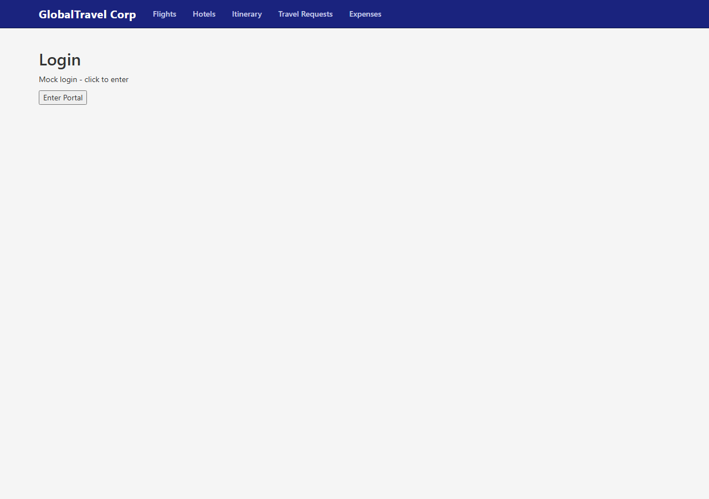
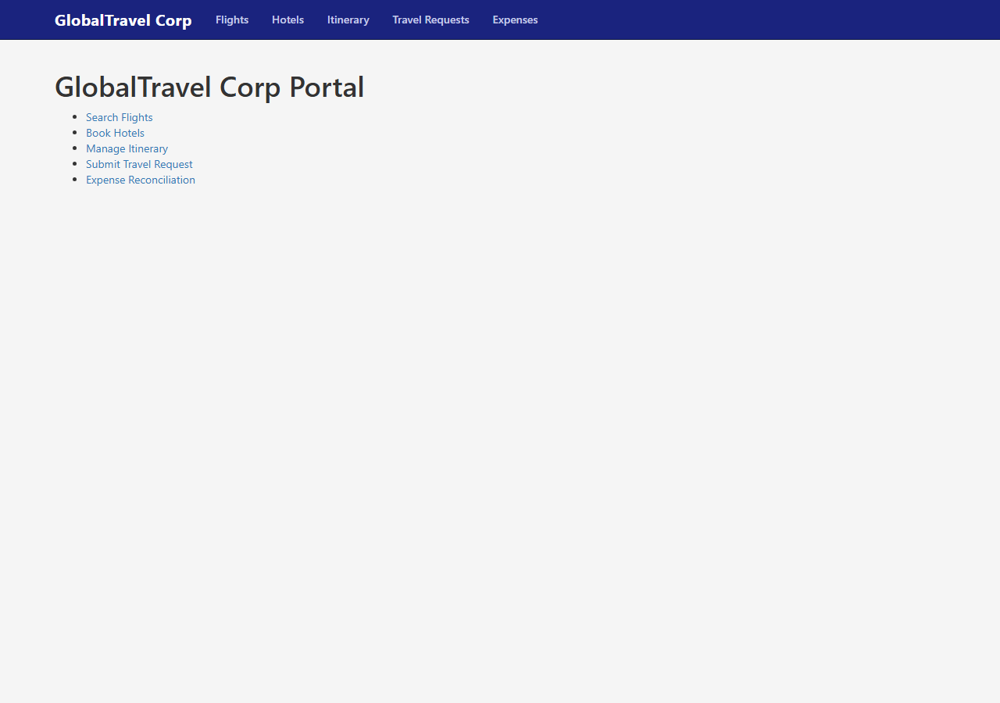
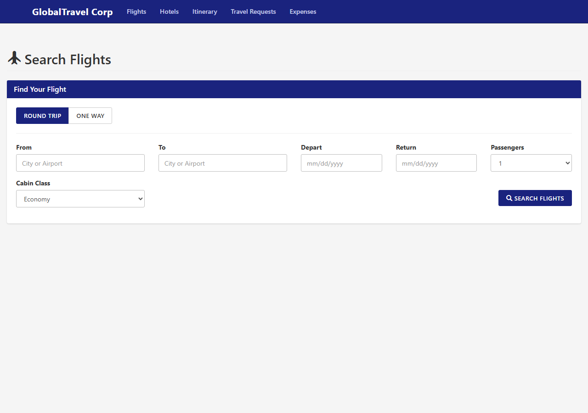
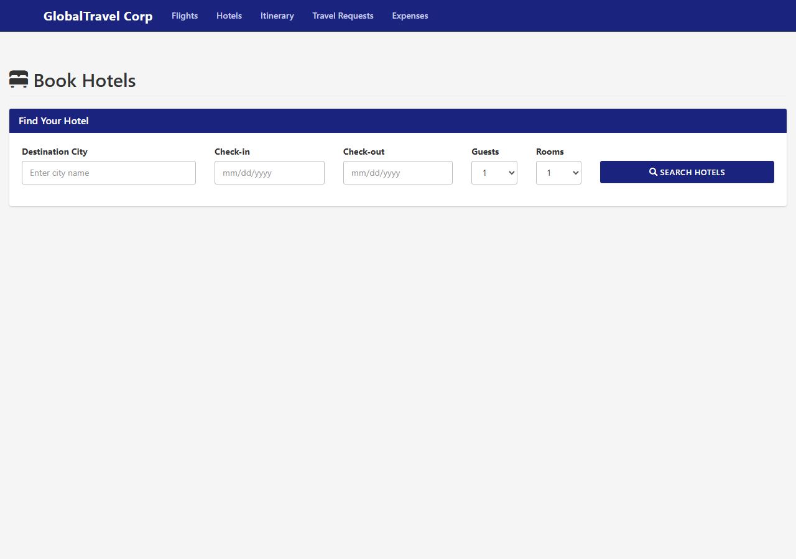
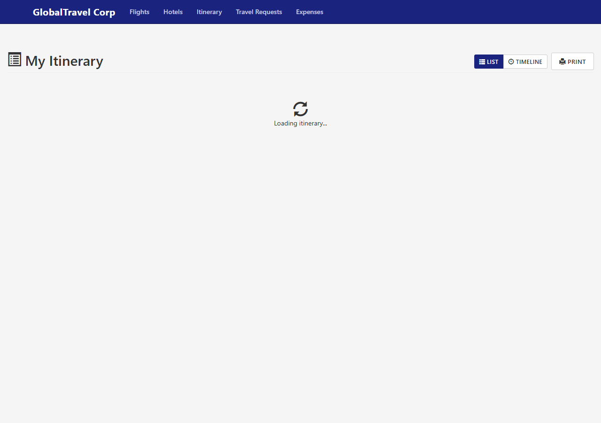
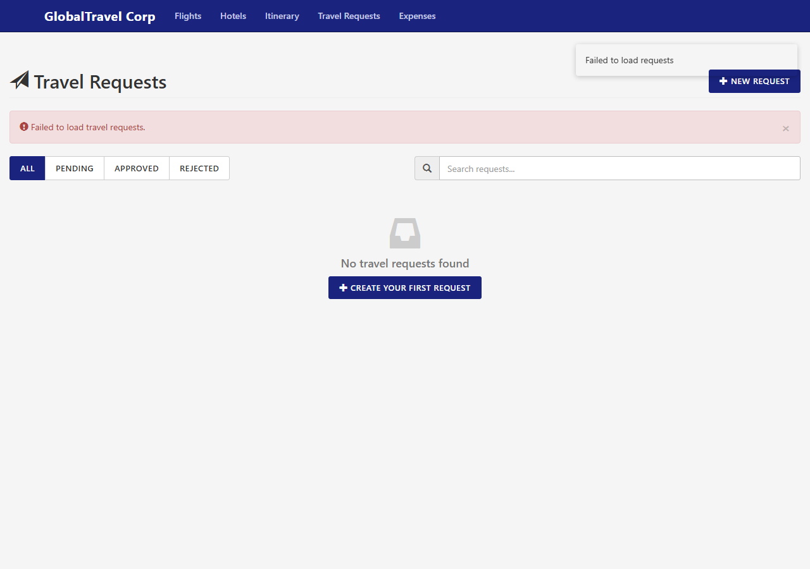
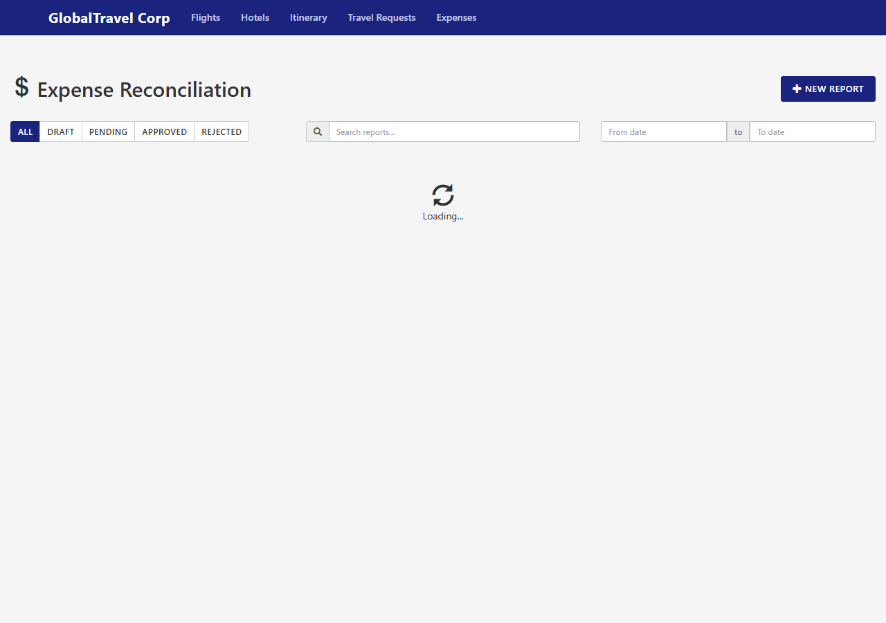

## Overview

This lab walks you through modernizing a legacy AngularJS 1.x single-page application into a fully typed, component-driven app built with either **React 18** or **Angular 17** and **TypeScript**. You will migrate routing, state management, API integration, and UI components while preserving existing functionality — ultimately producing a maintainable, testable codebase ready for production deployment on Azure Static Web Apps.

## The Legacy Application

The starting point is **GlobalTravel Corp — Corporate Travel Portal**, a full-featured AngularJS 1.6.x SPA that manages corporate travel workflows. It relies on UI-Router for navigation, Restangular for REST API calls, Bootstrap 3 for styling, and a Bower/Grunt toolchain — all patterns that have since been superseded by modern frameworks and bundlers.

### Application Entry Point

Users are greeted by a simple login screen before being routed to the main dashboard, which serves as the hub for every travel module.


*The login screen uses mock authentication, storing a JWT in `localStorage` to gate access to the portal.*


*The dashboard links to all five modules — Flights, Hotels, Itinerary, Travel Requests, and Expenses — each implemented as a separate UI-Router state.*

### Key Modules

The portal includes several data-rich modules with forms, filters, and API-driven result lists that must be faithfully recreated during the migration.


*The flight search module features round-trip/one-way toggling, date pickers, cabin class selection, and dynamic search results — showcasing the complexity that must carry over to the modern stack.*


*Hotel booking combines destination search, date ranges, and guest/room selectors with card-based results, illustrating the rich interactive UI the legacy app provides.*

---

## Initial Application Screenshots

The following screenshots capture the original AngularJS 1.6.x application ("GlobalTravel Corp — Corporate Travel Portal") before modernization. The app uses UI-Router for navigation, Restangular for API calls, Bootstrap 3 for styling, and Bower/Grunt for build tooling.

### Login Page

Simple mock login screen with an "Enter Portal" button. No form validation — authentication stores a JWT in `localStorage`.

### Dashboard

Main portal hub with links to all five modules: Flights, Hotels, Itinerary, Travel Requests, and Expenses.

### Flight Search

Round-trip / one-way toggle, origin/destination inputs, date pickers, cabin class selector, and passenger count. Search results populate below the form.

### Hotel Booking

Destination city, check-in/check-out dates, guest and room selectors with a search button. Results display hotel cards with ratings and amenities.

### Itinerary

List/Timeline/Print view toggle for managing booked trips. Shows a loading spinner while fetching itinerary data from the API.

### Travel Requests

Filterable list (All/Pending/Approved/Rejected) with search. Includes a "New Request" button and a "Create Your First Request" empty-state prompt. Shows API error handling when the backend is unreachable.

### Expense Reconciliation

Status filter tabs (All/Draft/Pending/Approved/Rejected), search bar, date range filter, and a "New Report" button. Displays a loading state while fetching expense reports.

---

## CLI Walkthrough — AngularJS to React Migration with GitHub Copilot CLI

This section documents the step-by-step migration performed using **GitHub Copilot CLI** (`gh copilot`). Each step was executed as a CLI prompt, with outputs captured to `assets/outputs/step-NN.txt`, committed, and tagged.

### Prerequisites

- Node.js 18+
- GitHub Copilot CLI (`gh copilot`)
- Git

### Setup

```powershell
cd appmodlab-angularjs-to-react-angular-modern
git checkout main && git checkout -b solution-final
New-Item -ItemType Directory -Force -Path assets/outputs
```

### Step 01 — Explore Legacy AngularJS (`step-01-explore-angularjs`)

Analyzed the complete AngularJS 1.6.x codebase:
- **5 controllers**: FlightSearch, HotelBooking, Itinerary, TravelRequest, Expense
- **8 services**: Auth, Api, User + 5 domain services
- **3 directives**: gt-date-picker, gt-currency-input, gt-approval-status
- **4 filters**: usdCurrency, gtDateFormat, gtTimeAgo, gtDuration
- **6 UI-Router states** with auth guards
- **Express mock API** on port 3000
- **Anti-patterns identified**: jQuery DOM manipulation, manual `$apply()`, deep `$watch`, `$rootScope` event bus

### Step 02 — Analyze Component Map (`step-02-component-map`)

Mapped every AngularJS artifact to its React equivalent:

| AngularJS | React |
|-----------|-------|
| `$stateProvider` | React Router v6 `<Routes>` |
| `AuthService` | `AuthContext` + `useAuth()` hook |
| `Restangular` | `apiClient` (typed fetch wrapper) |
| `$scope` / controllers | `useState` / page components |
| `$scope.$watch` | `useEffect` with dependencies |
| `$rootScope` events | React Context dispatch |
| Directives | Functional components |
| Filters | Utility functions |
| Moment.js | `Intl.DateTimeFormat` |
| Lodash | Native Array/Object methods |
| Bower/Grunt | npm/Vite |

### Step 03 — Scaffold React Project (`step-03-scaffold-react`)

```powershell
npm create vite@latest react-app -- --template react-ts
cd react-app && npm install react-router-dom@6
```

Created project structure:
```
react-app/src/
├── components/   # Navbar, DatePicker, CurrencyInput, ApprovalStatus, ProtectedRoute, NotificationArea
├── pages/        # LoginPage, DashboardPage, FlightSearchPage, HotelBookingPage, ItineraryPage, TravelRequestPage, ExpensePage
├── hooks/        # useFlights, useHotels, useItinerary, useTravelRequests, useExpenses
├── context/      # AuthContext, NotificationContext
├── utils/        # format.ts, api.ts
├── types/        # index.ts (all TypeScript interfaces)
├── App.tsx       # Root with routing
└── main.tsx      # Entry point
```

### Step 04 — Migrate Services (`step-04-migrate-services`)

Converted all AngularJS services to React hooks and context:

- **AuthService** → `AuthContext` + `useAuth()` — JWT in localStorage, login/logout/isAuthenticated
- **ApiService** → `utils/api.ts` — Typed fetch wrapper with auto-auth headers
- **FlightSearchService** → `useFlights()` — searchFlights, bookFlight, getPopularRoutes
- **HotelBookingService** → `useHotels()` — searchHotels, getHotelRooms, bookRoom
- **ItineraryService** → `useItinerary()` — loadTrips, selectTrip, addNote, cancelItem
- **TravelRequestService** → `useTravelRequests()` — CRUD operations
- **ExpenseService** → `useExpenses()` — reports, dashboard, receipt upload

Key modernizations: `$q` promises → async/await, Restangular → fetch API, Lodash → native methods.

### Step 05 — Migrate Components (`step-05-migrate-components`)

Converted all directives and controllers to React components:

**Directives → Components:**
- `gt-date-picker` → `DatePicker.tsx` (native `<input type="date">`)
- `gt-currency-input` → `CurrencyInput.tsx` (React events, no jQuery)
- `gt-approval-status` → `ApprovalStatus.tsx` (JSX badges, no string HTML)

**Controllers → Pages:**
- `FlightSearchController` → `FlightSearchPage.tsx` — search form, filters, results, booking
- `HotelBookingController` → `HotelBookingPage.tsx` — search, rooms, booking
- `ItineraryController` → `ItineraryPage.tsx` — trips, day groups, notes
- `TravelRequestController` → `TravelRequestPage.tsx` — CRUD, cost breakdown, approval
- `ExpenseController` → `ExpensePage.tsx` — dashboard, reports, receipt upload

### Step 06 — Migrate Routing (`step-06-migrate-routing`)

Converted UI-Router to React Router v6:

- `$stateProvider.state()` → `<Route>` elements in `App.tsx`
- `$urlRouterProvider.otherwise` → `<Navigate to="/login">`
- `ui-sref` → `<NavLink>` with active styling
- `$stateChangeStart` guard → `<ProtectedRoute>` layout component
- `$state.go()` → `useNavigate()` hook

### Step 07 — Add State Management (`step-07-state-management`)

Implemented React Context API replacing `$rootScope`:

- **AuthContext** — global auth state (user, token, login/logout)
- **NotificationContext** — toast notifications with auto-dismiss
- **Custom hooks** — domain state containers (flights, hotels, itinerary, travel requests, expenses)
- Eliminated: `$rootScope` event bus, deep `$watch`, manual `$apply()`, service singletons

### Step 08 — Build and Test (`step-08-build-test`)

```powershell
cd react-app && npm run build
```

**Results:**
- TypeScript compilation: **0 errors**
- Vite production build: **40 modules** transformed
- Bundle: **284 KB** (83 KB gzipped)
- Build time: **178ms**

### Tags

```
step-01-explore-angularjs
step-02-component-map
step-03-scaffold-react
step-04-migrate-services
step-05-migrate-components
step-06-migrate-routing
step-07-state-management
step-08-build-test
```

### Migration Summary

| Metric | Before (AngularJS) | After (React) |
|--------|--------------------|-|
| Framework | AngularJS 1.6.10 | React 19 + TypeScript |
| Build Tool | Grunt | Vite 8 |
| Package Manager | Bower | npm |
| Routing | UI-Router 0.4 | React Router 6 |
| HTTP Client | Restangular | Native fetch |
| State | $rootScope/$scope | Context API + hooks |
| Date Formatting | Moment.js | Intl.DateTimeFormat |
| Utilities | Lodash | Native JS |
| DOM Manipulation | jQuery | React refs |
| Type Safety | None | TypeScript strict |
| Bundle Size | ~1.2 MB (unminified) | 83 KB (gzipped) |
